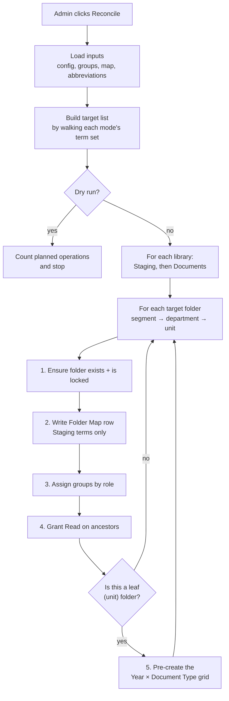
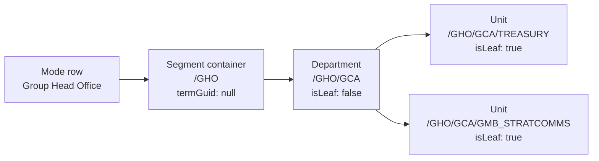
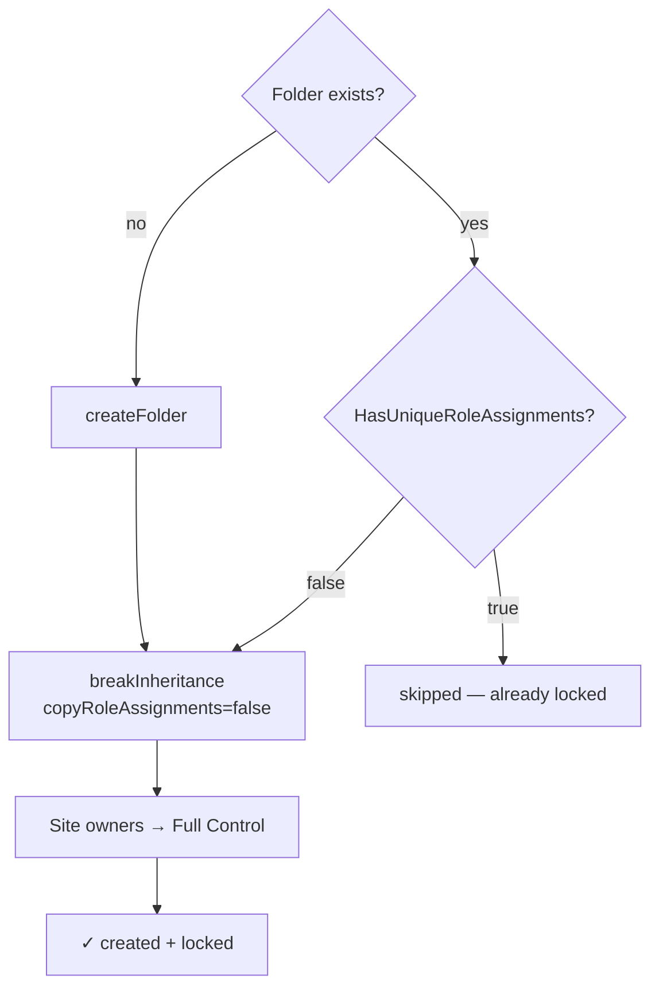
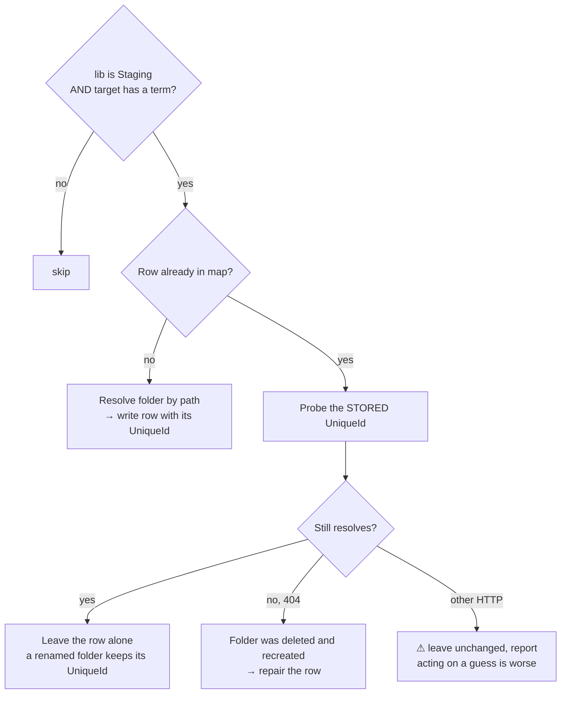
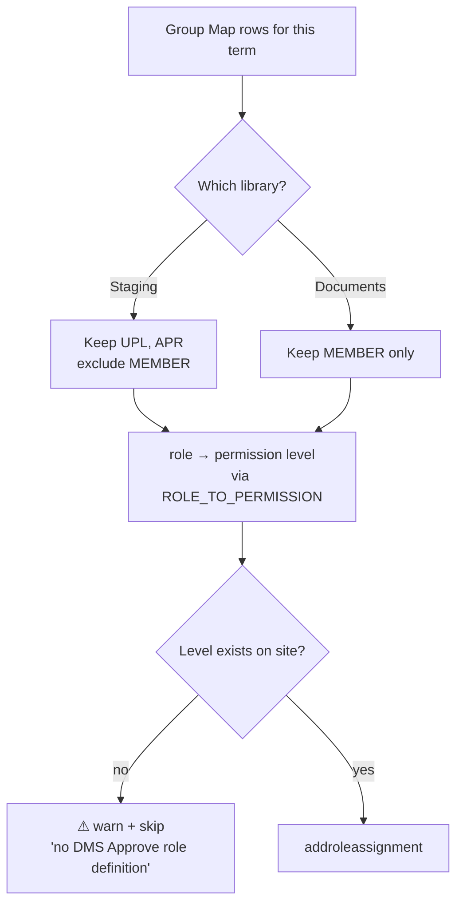
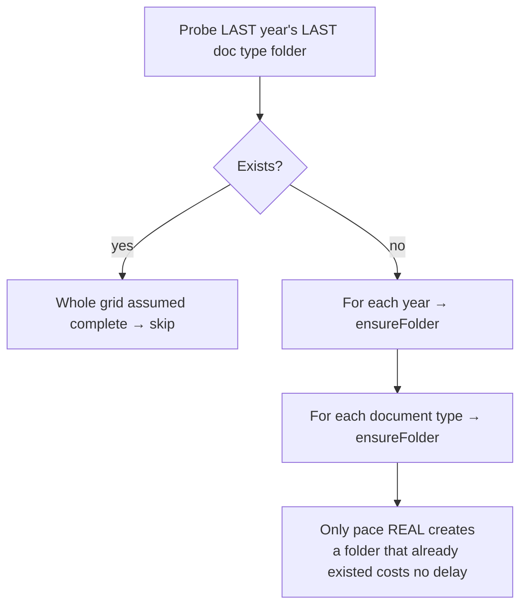

# Folder Reconciliation — How It Actually Works

Reference for `runReconciliation` in
[`src/webparts/folderManager/components/FolderManager.tsx`](../src/webparts/folderManager/components/FolderManager.tsx).
Line numbers are from 2026-07-31. Preview this file in VS Code (`Ctrl+Shift+V`)
to see the diagrams rendered.

---

## What it is for

Reconciliation is the **only** thing that creates secured folders. The upload
forms cannot: an uploader holds Contribute, and breaking permission inheritance
requires Manage Permissions, which only Full Control has. So every folder that
needs its own ACL must exist *before* anyone uploads into it.

It answers one question per folder — *does this folder exist, is it locked, and
do the right groups have the right access?* — and fixes whatever is missing.

It is **idempotent**. Running it twice is safe; running it after a change is how
the change takes effect.

---

## Big picture



---

## Phase 1 — Load inputs

Everything is read up front so the loop makes no avoidable round-trips.

| Input | Source | Used for |
| ----- | ------ | -------- |
| Modes | `DMS Config` rows where `ConfigType = mode` | which term sets to walk, and the segment folder name |
| Group rows | `DMS Group Map` | which SP group gets which permission on which folder |
| Folder map rows | `DMS Folder Map` | whether a term is already mapped, and to what |
| Abbreviations | `DMS Term Abbreviation` | the folder **name** for each term |
| Year / Document Type labels | term store | the grid pre-created under each unit |
| Role definitions | `/_api/web/roledefinitions` | translating `UPL` → the site's "Contribute" id |

If a mode row has an empty or old-schema `Levels`, `parseReconModes` **drops it
silently**. A trailing space in a GUID does the same. That is the most common
"nothing happened" cause.

---

## Phase 2 — Build the target list

Each mode's term set is walked into a flat list of `ProvTarget`:

```
{ termGuid, assignTerm, relPath, label, section, isLeaf }
```



Two things worth knowing:

- **The segment container has no term.** Its name comes from the mode row's
  `StagingFolder`, not from the abbreviation list — there is no term to look up.
- **`relPath` uses abbreviations**, not term labels: `GHO/GCA/TREASURY`, not
  `Group Head Office/Group Corporate Affairs/Treasury`.

---

## Phase 3 — The main loop

Two nested loops: **library**, then **target**. Everything below runs once per
folder per library.

### Step 1 — Ensure the folder exists and is locked

[Lines 1316-1338](../src/webparts/folderManager/components/FolderManager.tsx#L1316-L1338)



`copyRoleAssignments=false` means the folder starts with **no** access at all
except site owners. Everything else is granted deliberately in step 3. That is
what makes units isolated from one another.

Note that **every** tier breaks inheritance — segments and departments too, not
only units. A site with 3 segments, 42 departments and 133 units therefore has
**178 unique permission scopes per library**, plus the library-level break.

### Step 2 — Write the Folder Map row

[Lines 1340-1400](../src/webparts/folderManager/components/FolderManager.tsx#L1340-L1400)

Only for **Staging**, and only for targets that have a term (so the segment
container is skipped).



**Why the map exists at all:** the upload form resolves its destination by
`FolderUniqueId`, never by path. A UniqueId survives renaming and moving, so
renaming a folder in SharePoint does not break uploads. That is the whole point.

**Uploads cannot work before this list is populated.**

### Step 3 — Assign groups by role

[Lines 1403-1439](../src/webparts/folderManager/components/FolderManager.tsx#L1403-L1439)



**The isolation rule:** `MEMBER` (base viewer) groups are Documents-only and
must never land on Staging — otherwise a read-only viewer sees pending,
unapproved documents. `UPL`/`APR` are Staging-only for the mirror reason.

A folder whose term has no group rows is reported as *"locked admin-only"* —
created and secured, reachable by nobody but site owners. A safe outcome, not a
failure.

### Step 4 — Grant Read on ancestors

[Lines 1444-1456](../src/webparts/folderManager/components/FolderManager.tsx#L1444-L1456)

Every group just granted on a folder also gets **Read on each ancestor folder**
in the same library:

```
TREASURY_UPL granted Contribute on  /GHO/GCA/TREASURY
                     then Read on   /GHO/GCA
                     then Read on   /GHO
```

Without this a user can reach their folder by direct link but cannot browse to
it — SharePoint's automatic Limited Access permits neither listing nor
navigation. Siblings get no grant, so SharePoint security-trims them: each user
sees only their own corridor.

This is also why ancestor folders must contain **only folders, never files**.
Read on a folder shows everything inside it.

### Step 5 — Pre-create the Year × Document Type grid

[Lines 1457-1501](../src/webparts/folderManager/components/FolderManager.tsx#L1457-L1501) — leaf (unit) folders only.



These folders **inherit** the unit's ACL. They are not locked, not mapped, and
cost no permission scopes — only creation time.

**The fast path is why a no-op re-run takes minutes instead of hours.** One
probe replaces 63 round-trips per unit per library. Measured before it existed:
6,090 folders in 111 minutes for 48 units.

**Its known defect:** the probe targets the *last* year in the list. Add a year
that does not sort last — 2020 into a list ending 2030 — and the probe still
succeeds, the grid is skipped, and that year's folders are never created.
Silently.

---

## What reconciliation never does

Knowing the boundaries saves as much time as knowing the steps.

| It does not | Consequence |
| ----------- | ----------- |
| **Revoke anything.** It only ever *adds* role assignments. | Deleting a `DMS Group Map` row does not remove access. Removing the user from the SP group is the only real revocation. |
| **Rename folders** when an abbreviation changes. | A renamed term keeps its old folder name until the rename feature lands. |
| **Delete folders** for removed terms. | Orphaned folders persist and must be removed by hand. |
| **Approve folders.** | Reconciliation-created folders are themselves *Pending* under content approval. With Draft Item Security set wrongly, users see an empty Staging library — memory `dms-content-approval-blocks-uploader`. |
| **Map Documents folders.** | Documents has no map rows; the auto-route flow finds its targets by path. |

---

## Where the HC change plugs in

The planned Highly Confidential work
([design](superpowers/specs/2026-07-16-highly-confidential-securing-design.md))
changes exactly two things in this flow:

1. **The library loop gains two members** — `HCApproval` and `HCLibrary`.
2. **Step 5 is skipped for them.** HC libraries have no Year × Document Type
   grid; both become metadata columns. Steps 1-4 run unchanged.

Two traps to respect when making that change:

- **`mapByTerm` keys on term alone.** Step 2 would find the *Staging* row while
  processing HC Approval, conclude "already mapped", and never write the HC row.
  The folder would exist and be correctly secured, the log would report success,
  and every HC upload would fail with "folder hasn't been set up yet" — forever,
  because each re-run repeats the same deduction. Re-key on `term|library` in
  the same commit that adds the library.
- **Step 3's library filter is a binary `if`.** `lib === "Staging" ? … : …`
  sends anything that is not Staging down the Documents branch, so HC Approval
  would receive `MEMBER` groups and none of its `HC` groups. It has to become a
  real per-library mapping, not a two-way test.
