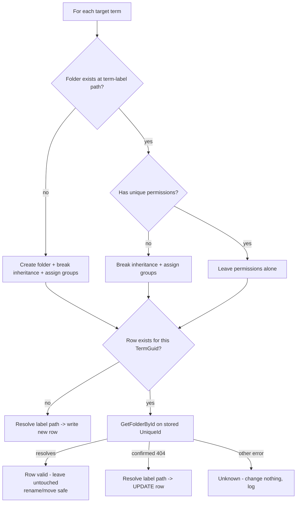
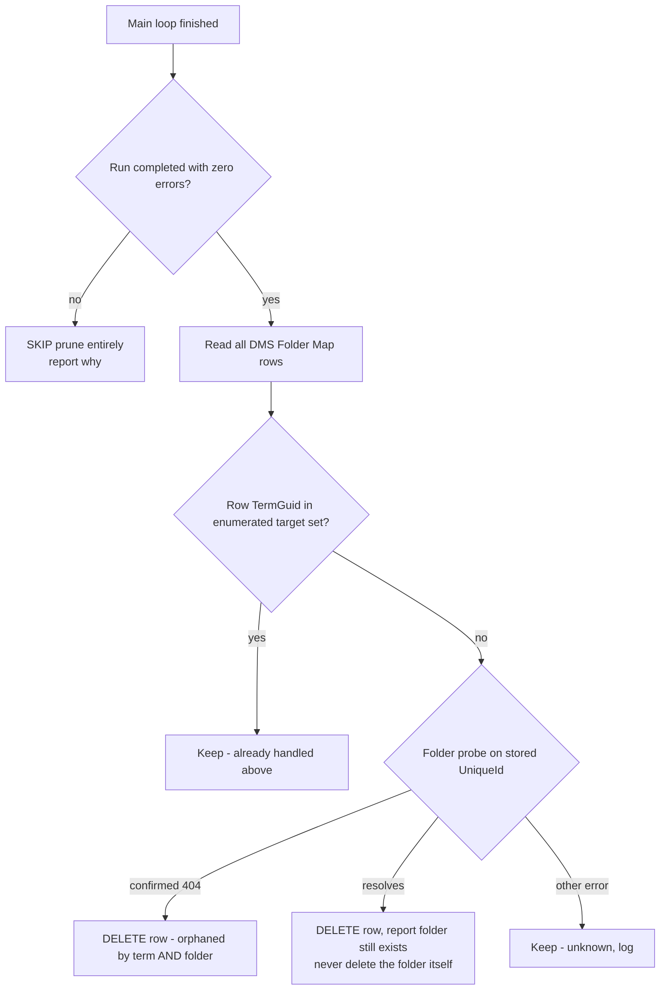

# Folder Map Integrity — Design

**Date:** 2026-07-29
**Status:** Agreed, not yet implemented
**Touches:** `FolderManager.tsx` (reconciliation), `dmsFolderMap.ts`, `Form.tsx` (vendor cleanup)

---

## Problem

`DMS Folder Map` maps a **leaf term GUID** → a **folder UniqueId**. Nothing keeps it in sync with
reality. SharePoint has no referential integrity between a document-library folder and a custom
list, and this solution has no event receiver or webhook watching for folder deletion. Rows are
only ever *written* (`FolderManager.tsx:1138`); nothing updates or deletes them.

Two consequences:

1. **A stale row is never repaired.** Reconciliation skips any term already present in the map
   (`FolderManager.tsx:1135`, `!mapped.has(t.termGuid)`). A folder that was deleted and recreated
   gets a **new UniqueId**, but the row still holds the dead one. Reconciliation reports
   "created + locked ✓", the library looks correct, and every upload to that unit fails
   permanently — with a message telling the admin to re-run the very thing that just failed to
   help (`Form.tsx:899`, `BulkUpload.tsx:1319`).
2. **A row whose term no longer exists is never visited.** Reconciliation only walks terms
   currently in the term store, so a row orphaned by term deletion lingers forever.

## The key insight: verify by UniqueId, not by path

The obvious fix — "resolve the term-label path, compare to the stored UniqueId, overwrite if they
differ" — is **wrong**, and would destroy the rename-proofing that is the whole point of this design.

If an admin renames a Unit folder, the folder keeps its UniqueId (the row stays valid and uploads
keep working), but the term-label path now points at *nothing*. Reconciliation would create a fresh
empty folder at that path, the naive check would see a different UniqueId, and the row would be
repointed at the new empty folder — abandoning the real folder and all its documents.

**Correct rule:** ask whether the *stored* UniqueId is still alive, via `GetFolderById`.

- **Resolves** → the row is valid. Leave it alone, whatever its name or location. Rename-proofing preserved.
- **Confirmed 404** → the row is dead. Resolve the term-label path and write that UniqueId.
- **Anything else** (403 / 400 / 429 / 5xx) → we do not know. Change nothing, log loudly.

Cost is one extra `GetFolderById` per mapped term per run (~133 GETs at full scope), which is small
next to what reconciliation already does.

## Reconciliation flow, per term



Then, once every term has been processed:



## Scenario matrix

"Upload" = what an uploader sees. "Recon" = what a reconciliation run does.

| # | Event | Today | After the fix |
|---|-------|-------|---------------|
| 1 | **Unit folder renamed**, term unchanged | Upload ✅ (UniqueId survives rename). Recon creates a *duplicate* empty folder at the term-label path; row untouched | Upload ✅. Row untouched — stored UniqueId still resolves. Duplicate-folder issue remains (see Limitations) |
| 2 | **Folder deleted**, term still exists, not restored | Upload ❌ "no longer exists". Recon recreates the folder but **skips the row** → broken forever | Recon recreates folder, sees stored UniqueId 404, **rewrites row** → ✅ self-healed |
| 3 | **Folder deleted, then restored** from recycle bin | UniqueId is preserved on restore → row valid again, upload ✅ | Same ✅ — *if* you restore **before** reconciling. Reconcile first and you get a second folder plus a repointed row; the restored folder (with its documents) comes back unmapped |
| 4 | **Folder deleted, manually recreated** with the same name | Upload ❌ forever. Recon does not fix it | Recon rewrites the row to the new UniqueId, and re-breaks inheritance since the recreated folder inherits ✅ |
| 5 | **Folder moved** to a different parent | Upload ✅ but files land in the moved location. Recon creates a duplicate at the original path | Row untouched (UniqueId resolves) — uploads keep going to the moved folder. Documents-library mirroring breaks (see Limitations) |
| 6 | **New term added** to the term store | Folder created, row written ✅ | Unchanged ✅ |
| 7 | **Term renamed** (same GUID) | Upload ✅. Recon creates a duplicate empty folder under the new label | Upload ✅, row untouched. Duplicate-folder issue remains |
| 8 | **Term deleted**, folder remains | Row lingers forever, invisible | Prune deletes the row and **reports** the leftover folder. The folder is never auto-deleted |
| 9 | **Term deleted and folder deleted** | Row lingers forever | Prune deletes the row ✅ |
| 10 | **Folder created manually**, term exists, no row | Recon finds it, writes the row ✅ | Unchanged ✅ |
| 11 | **Run is throttled or partially fails** | n/a | Prune is **skipped entirely**; row updates only happen on confirmed 404s |

## Prune — design

Runs as a final phase of reconciliation, not a separate button: the run has just enumerated every
valid term, which is exactly the knowledge prune needs.

**Three guards, all required:**

1. **Zero-error precondition.** If any part of the run failed, skip pruning. A half-failed term-store
   read returns a short target list, and a short list makes healthy rows look orphaned — that is a
   mass-deletion bug waiting to happen.
2. **Positive evidence only.** Delete on a confirmed 404. Never on 403, 400, 429 or 5xx.
   `probeFolderByPath` already draws exactly this line with its `confirmedMissing` flag; reuse it
   rather than inventing a second existence check.
3. **Log every deletion** into the same progress log as the rest of the run.

**Never deletes folders or documents.** Prune only removes list rows.

Default: automatic on every clean run. Rationale — an admin who must remember a checkbox will
forget, and the guards make it safe.

## Vendor cleanup (folded in)

Vendor is free text (`Form.tsx:1354`), and its term set was deleted from the site. Remove the dead
`loadTermSet` call at `Form.tsx:699`, the `vendor` entry in `DEFAULT_SETTINGS.termSets`, and the
`termSet_vendor` row from `DMS Config`. Currently it fires a guaranteed 404 on every form load,
swallowed by `.catch()`.

## Admin guidance: how to actually delete a folder

**The term store is the source of truth. Reconciliation rebuilds anything the term store
names.** So deleting a folder while its term is still alive does not remove it — the next
run recreates it (empty — the documents stay in the recycle bin) and repoints the map row at
the new empty folder, so uploads silently resume into the wrong place.

**Always delete the term first.**

```
1. Delete the term (or term set) in the term store
2. Delete the folder in SharePoint        ← safe now: nothing will recreate it
3. Run reconciliation                     → prune removes the row ("term and folder both gone")
```

Or, to be told before committing:

```
1. Delete the term in the term store
2. Run reconciliation   → prune removes the row and reports
                          "folder still exists at /… — delete manually if intended"
3. Delete the folder using the reported path
```

Between deleting a folder and the next run, uploads to that unit fail with
"The mapped unit folder no longer exists" (`Form.tsx`, `BulkUpload.tsx`).

If a term was deleted **by mistake**: do NOT delete the folder. Re-import the term with the
same label and the next run re-adopts the existing folder — documents intact, new row written.
Losing the row costs nothing; see the reconstructible/irreplaceable split above.

## Rule: DMS Config `mode` rows are for LIVE term sets only

Never leave a `mode` row pointing at a term set that does not exist yet — not as a
placeholder, not "so we remember it later". The consequences are not cosmetic:

- `buildProvisionTargets` pushes the segment CONTAINER target before it reads the term
  set, so an empty, locked, group-less segment folder is created in both libraries.
- The term-set read then throws, the segment is marked `incomplete`, and **prune is
  disabled for that run — every run, permanently, while the row exists.**

A segment is onboarded by ADDING its mode row and retired by REMOVING it. The row is the
switch. (Upstream Malaysia Head Office was removed from DMS Config on 2026-07-29 for
exactly this reason; it stays in the `RECON_MODES` code fallback as an inert slot-holder.)

Removing a mode row has one side effect worth knowing: that segment's terms stop being
enumerated, so on the next clean run **prune deletes its Folder Map rows**. The folders
and their documents are untouched, and re-adding the mode row lets the next run re-adopt
them — but do not remove a mode row for a live segment as a "temporary" measure.

## Known limitations (not fixed here)

- **Renaming a term or a Unit folder produces a duplicate empty folder** on the next run, because
  folder creation is keyed on the term-label path while mapping is keyed on the term GUID
  (scenarios 1, 5, 7). Options: (a) leave it, document "do not rename Unit folders"; (b) if a term
  already has a live mapped folder, treat that folder as the term's folder, skip creation, and warn
  when its name differs from the term label. **Recommend (b)** — it makes rename genuinely safe — but
  it changes folder-creation logic and belongs in its own change.
- **Documents-library mirroring is path-derived, not mapped.** `BulkUpload.tsx:1324` reaches the
  Documents twin by swapping the library segment of the Staging path. Renaming or moving a Staging
  folder without doing the same to its Documents twin breaks that lookup. Only Staging folders are
  mapped (`FolderManager.tsx:1135`).
- **Duplicate rows for one term** are not deduped. `lookupFolderMapping` takes `$top=1`, so a
  duplicate would resolve arbitrarily. Only reachable via concurrent reconciliation runs; low risk.

## Out of scope

Auto-deleting folders, an event receiver or webhook for real-time cascade, and any change to the
Auto-route flow.
